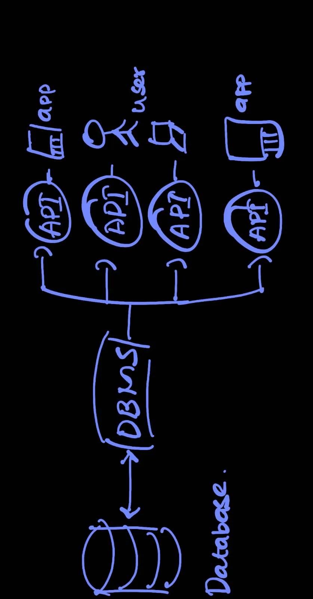

# Databases and DBMS:

Ever wonder where all the digital information you interact with goes? From your favorite social media posts to your online shopping cart, it all lives in a **Database**.

## What is a Database?

Imagine a super-organized digital filing cabinet. That's essentially a **Database**! It's an organized collection of structured information, or data, typically stored electronically. Think of it like a library – but for data.

## What is a DBMS?

Now, managing that massive filing cabinet by hand would be a nightmare! That's where the **Database Management System (DBMS)** comes in. A DBMS is like the librarian of our data library. It's a sophisticated software program that acts as the brain, allowing you to:

* **Retrieve** information (e.g., "Show me all products priced under $50").
* **Update** information (e.g., "Change my shipping address").
* **Manage** how the information is organized and optimized.

Together, the data, the DBMS, and any applications using them form a **Database System**.

### The Data Flow: Database to User

  

This image perfectly illustrates how a user interacts with the data. Your application (like a mobile app or website) talks to the DBMS, which then fetches or stores data in the actual database.

## Key Components of a Database

Databases, no matter their type, share some common building blocks:

* **Schema:** The blueprint or rules for your data. It defines the structure and what kind of data can go where.
    * *Example:* A `Users` schema might say "name must be text, age must be a number."
* **Table:** A collection of related data organized into rows and columns, much like a spreadsheet.
    * *Example:* A `Products` table would hold details about different products.
* **Column (or Field):** A vertical set of data values of a particular type within a table.
    * *Example:* In a `Products` table, you might have columns for `product_name`, `price`, `stock_quantity`.
* **Row (or Record/Tuple):** A single entry or record in a table, containing data across all columns for that entry.
    * *Example:* One row in the `Products` table could be: "Laptop Pro | $1200 | 50".

## Types of Databases

The database world is diverse! Here are some common categories:

* **SQL (Relational):** The classic, structured choice. Think tables with strict schemas and powerful relationships. (More in `SQL_Databases.md`)
* **NoSQL (Non-relational):** More flexible and scalable for modern, unstructured data. (More in `NoSQL_Databases.md`)
    * **Document:** Stores data in flexible, semi-structured documents (e.g., JSON). Great for catalogs.
    * **Key-value:** Simple, fast storage where each item has a key and a value. Good for caching or user sessions.
    * **Graph:** Designed for relationships between entities. Perfect for social networks or recommendation engines.
    * **Timeseries:** Optimized for data points indexed by time. Ideal for IoT sensor data or stock prices.
    * **Wide Column:** Column-oriented storage for very large datasets.
    * **Multi-model:** Databases that support multiple data models (e.g., document, graph, key-value) in one system.

*(For a deep dive into SQL vs. NoSQL, check out `SQL_vs_NoSQL.md`!)*

## Navigating Database Challenges at Scale

Navigating Database Challenges at Scale

=> Running databases for massive data comes with significant hurdles:

* **Data Volume**: Handling the relentless explosion of data from diverse sources.

* **Security**: Protecting sensitive information while ensuring constant accessibility.

* **Real-time Demand**: Meeting the need for instant data access for timely decision-making.

* **Management Overhead**: The increasing complexity and cost of maintaining growing databases.

* **Scalability Limits**: Overcoming the inherent difficulty of scaling traditional databases to infinite capacity.

* **Residency & Latency**: Adhering to data location requirements and ensuring ultra-low response times.

Mastering these challenges is crucial for building robust, scalable systems!
